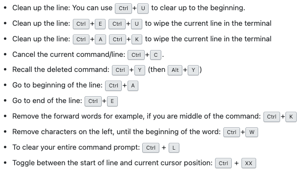

# me-config
[Me] My configs for the environment

## macOS specific

### Terminal shortcuts
  
[*https://stackoverflow.com/a/16687377/7502538*](https://stackoverflow.com/a/16687377/7502538)

### System information
- [Show RAM utilization info: vm_stat, top](https://gist.github.com/aalexren/4dba2b850928077e41d3ee2840a15e5b)

## Terminal

[Best CLI tools](https://habr.com/ru/articles/711968/)

### iTerm2
- [Dracula theme](https://draculatheme.com/iterm)
- [exiftool – change meta data](https://github.com/exiftool/exiftool)

### Homebrew
- tldr: Simplified and community-driven man pages
- tree: Display directories as trees (with optional color/HTML output)
- zsh-syntax-highlighting: Fish shell like syntax highlighting for zsh
- watch: Executes a program periodically, showing output fullscreen
- nmap: Port scanning utility for large networks
- neofetch: Fast, highly customisable system info script
- neovim: Ambitious Vim-fork focused on extensibility and agility
- jq: Lightweight and flexible command-line JSON processor
- imagemagick: Tools and libraries to manipulate images in many formats
- jpegoptim: Utility to optimize JPEG files
- ffmpeg: Play, record, convert, and stream audio and video
- fd: Simple, fast and user-friendly alternative to find
- exa: Modern replacement for 'ls'
- cloc: Statistics utility to count lines of code
- bat: Clone of cat(1) with syntax highlighting and Git integration

### ZSH
- [oh-my-zsh plugin](https://github.com/ohmyzsh/ohmyzsh/wiki/Plugins)
- - [aliases (acs)](https://github.com/ohmyzsh/ohmyzsh/tree/master/plugins/aliases)
- [powerline10k theme](https://github.com/romkatv/powerlevel10k)

#### oh-my-zsh plugins
- [z to jump over folder](https://github.com/ohmyzsh/ohmyzsh/tree/master/plugins/z)
- [git short hand](https://github.com/ohmyzsh/ohmyzsh/tree/master/plugins/git)
- [zsh-syntax-highlighting](https://github.com/zsh-users/zsh-syntax-highlighting/blob/master/INSTALL.md)
- [auto suggestions plugin](https://github.com/zsh-users/zsh-autosuggestions)
- [zsh-aliases-exa](https://github.com/DarrinTisdale/zsh-aliases-exa)
- [fd](https://github.com/ohmyzsh/ohmyzsh/tree/master/plugins/fd)

### Fish shell

Fish shell

- [Make default shell](https://stackoverflow.com/questions/453236/how-can-i-set-my-default-shell-on-a-mac-e-g-to-fish)
- [Fisher plugin manager](https://github.com/jorgebucaran/fisher)
- [Git plugin](https://github.com/jhillyerd/plugin-git) (install using fisher, not omf)
- [Tide theme like powerline10k](https://github.com/IlanCosman/tide)
- [Z (to easy navigate)](https://github.com/rupa/z)
- [Sponge to clear unrelated history](https://github.com/meaningful-ooo/sponge)
- [Dracula colors](https://github.com/dracula/fish)
- [fish-exa (beauty ls and exa)](https://github.com/gazorby/fish-exa)
- [Bat (better cat command)](https://github.com/sharkdp/bat)
- [fd (easy find command)](https://github.com/sharkdp/fd)

### Some LSCOLORS AND LS_COLORS
- [Interactive colorized](https://geoff.greer.fm/lscolors/)
- [Some help github gist](https://gist.github.com/aalexren/f840430608e80f1cdbf466a0c585f45e)
