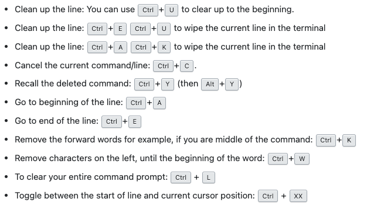

# My config files

Config files for language-specific development and for the environment in general.

| | Section |
|---|---|
| :snake: | [Python](./python) |
| :apple: | [macOS / Terminal](./dot) |
| :robot: | [LLM / Pi Agent](./llm) |
| :database: | [DBeaver](./dbeaver) |

---

## macOS specific

### Terminal shortcuts

  
[*https://stackoverflow.com/a/16687377/7502538*](https://stackoverflow.com/a/16687377/7502538)

### System information

- [Show RAM utilization info: vm_stat, top](https://gist.github.com/aalexren/4dba2b850928077e41d3ee2840a15e5b)

---

## Terminal

[Best CLI tools](https://habr.com/ru/articles/711968/)

### iTerm2

- [Dracula theme](https://draculatheme.com/iterm)
- [exiftool — change meta data](https://github.com/exiftool/exiftool)

### Homebrew

| Formula | What it does |
|---|---|
| [tldr](https://tldr.sh/) | Simplified, community-driven man pages |
| [tree](https://oldmanprogrammer.net/source.php?dir=projects/tree) | Display directories as trees |
| [zsh-syntax-highlighting](https://github.com/zsh-users/zsh-syntax-highlighting) | Fish-like syntax highlighting for zsh |
| [watch](https://linux.die.net/man/1/watch) | Execute a program periodically, fullscreen output |
| [nmap](https://nmap.org/) | Port scanning utility for large networks |
| [neofetch](https://github.com/dylanaraps/neofetch) | Fast, highly customisable system info script |
| [neovim](https://neovim.io/) | Ambitious Vim-fork focused on extensibility |
| [jq](https://stedolan.github.io/jq/) | Lightweight command-line JSON processor |
| [imagemagick](https://imagemagick.org/) | Tools and libraries to manipulate images |
| [jpegoptim](https://github.com/tjko/jpegoptim) | Utility to optimize JPEG files |
| [ffmpeg](https://ffmpeg.org/) | Play, record, convert, and stream audio and video |
| [fd](https://github.com/sharkdp/fd) | Simple, fast, user-friendly alternative to `find` |
| [eza](https://github.com/eza-community/eza) | Modern replacement for `ls` (maintained fork of `exa`) |
| [bat](https://github.com/sharkdp/bat) | `cat` clone with syntax highlighting and Git integration |
| [ripgrep](https://github.com/BurntSushi/ripgrep) | Faster `grep` alternative, respects gitignore |
| [fzf](https://github.com/junegunn/fzf) | Command-line fuzzy finder |
| [gh](https://cli.github.com/) | GitHub CLI — repos, PRs, issues from the terminal |
| [delta](https://github.com/dandavison/delta) | Syntax-highlighted `git diff` viewer |
| [lazygit](https://github.com/jesseduffield/lazygit) | Terminal UI for Git |
| [cloc](https://github.com/AlDanial/cloc) | Count lines of code by language |

### ZSH

- [oh-my-zsh](https://github.com/ohmyzsh/ohmyzsh/wiki/Plugins) — plugin manager
- [aliases (acs)](https://github.com/ohmyzsh/ohmyzsh/tree/master/plugins/aliases) — handy alias listing
- [powerlevel10k](https://github.com/romkatv/powerlevel10k) — theme

#### oh-my-zsh plugins (active in [`dot/.zshrc`](./dot/.zshrc))

- [git](https://github.com/ohmyzsh/ohmyzsh/tree/master/plugins/git) — git shorthand aliases
- [zsh-syntax-highlighting](https://github.com/zsh-users/zsh-syntax-highlighting) — fish-like highlighting
- [zsh-autosuggestions](https://github.com/zsh-users/zsh-autosuggestions) — fish-like suggestions
- [z](https://github.com/ohmyzsh/ohmyzsh/tree/master/plugins/z) — jump to frequent folders

Other useful plugins (not active)

- [zsh-aliases-eza](https://github.com/DarrinTisdale/zsh-aliases-eza) — aliases for `eza` (forked from `exa`)
- [fd](https://github.com/ohmyzsh/ohmyzsh/tree/master/plugins/fd) — oh-my-zsh wrapper

### Fish shell

Fish shell setup

- [Make default shell](https://stackoverflow.com/questions/453236/how-can-i-set-my-default-shell-on-a-mac-e-g-to-fish)
- [Fisher plugin manager](https://github.com/jorgebucaran/fisher)
- [Git plugin](https://github.com/jhillyerd/plugin-git) (install using fisher, not omf)
- [Tide theme like powerline10k](https://github.com/IlanCosman/tide)
- [Z (to easy navigate)](https://github.com/rupa/z)
- [Sponge to clear unrelated history](https://github.com/meaningful-ooo/sponge)
- [Dracula colors](https://github.com/dracula/fish)
- [fish-exa (beauty ls and exa)](https://github.com/gazorby/fish-exa)
- [Bat (better cat command)](https://github.com/sharkdp/bat)
- [fd (easy find command)](https://github.com/sharkdp/fd)

### Some LSCOLORS AND LS_COLORS

- [Interactive colorized](https://geoff.greer.fm/lscolors/)
- [Some help github gist](https://gist.github.com/aalexren/f840430608e80f1cdbf466a0c585f45e)

---

## LLM / Pi Coding Agent

Full setup documented in [`llm/`](./llm) — installed extensions, `settings.json`, custom `pi-compaction-control` extension, and the `pi()` shell tool-excluder function.

- [Pi Coding Agent](https://github.com/earendil-works/pi) — the agent harness
- [pi-compaction-control](https://github.com/aalexren/pi-compaction-control) — my custom extension (context cap + compaction model)
- [pi-lens](https://github.com/apmantza/pi-lens) — LSP diagnostics + code navigation
- [context-mode](https://github.com/mksglu/context-mode) — run code over large outputs without flooding context
- [pi-web-access](https://github.com/nicobailon/pi-web-access) — web search + fetch
- [pi-mcp-adapter](https://github.com/nicobailon/pi-mcp-adapter) — MCP gateway
- [pi-auto-resume](https://github.com/kasaiarashi/pi-auto-resume) — auto-retry on rate limits
- [@latentminds/pi-quotas](https://github.com/latentminds-ai/pi-quotas) — usage/quota tracking
- [@tmustier/pi-extensions](https://github.com/tmustier/pi-extensions) — usage + tab status
